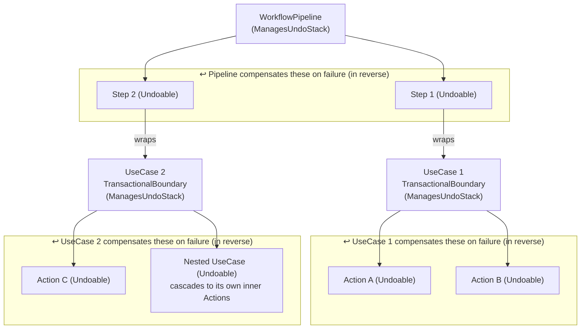
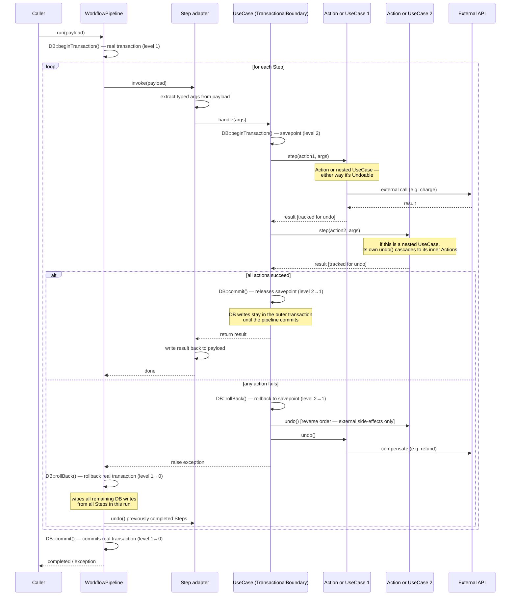

# splitstack/laravel-compensable

A lightweight saga pattern for Laravel. Brings explicit compensation contracts to Actions, UseCases, and Workflows.

---

## The Problem

When a workflow sequences DB writes alongside external API calls, no single transaction can provide consistency. DB transactions are local; Stripe charges, S3 puts, and webhook calls are not rollbackable. Standard try/catch leaves the compensation logic scattered and implicit.

This package makes it structural.

---

## Core Concepts

```text
Action        →  atomic unit. One thing. Declares its own undo.
UseCase       →  orchestrates Actions. Owns a DB transaction. Is itself undoable.
WorkflowPipeline  →  sequences UseCases/Actions via Steps. Owns the error boundary.
Step          →  thin adapter around any existing class. Declares compensation for code that can't.
```

**DB rollback is owned by the transaction. `undo()` is for everything else** (API calls, S3, webhooks). An Action whose only mutations are DB writes declares an empty `undo()` which is the explicit answer to the compensation question.

---

## Installation

```bash
composer require splitstack/laravel-compensable
```

The service provider is auto-discovered.

---

## Actions

```php
class ChargeStripe extends Action
{
    public function __construct(private readonly StripeClient $stripe) {}

    public function handle(...$args): string
    {
        [$order] = $args;
        return $this->stripe->charge($order->total); // returns chargeId
    }

    public function undo(mixed $result = null): void
    {
        // $result is what handle() returned — no DB lookup needed
        $this->stripe->refund($result);
    }
}

// DB-only action: transaction handles rollback, nothing to undo externally
class CreateOrder extends Action
{
    public function handle(...$args): Order { /* ... */ }
    public function undo(mixed $result = null): void {}
}
```

---

## UseCases

A UseCase is a `CompensableScope` over its Actions and is itself `Compensable` so a parent pipeline can undo it, cascading compensation down to every Action it ran.

```php
class PlaceOrder extends UseCase
{
    public function __construct(
        Transactioner $transactioner,
        private readonly CreateOrder $createOrder,
        private readonly ChargeStripe $chargeStripe,
    ) {
        parent::__construct($transactioner);
    }

    public function handle(...$args): Order
    {
        [$customer, $amount] = $args;

        return $this->executeWithEvents(function () use ($customer, $amount): Order {
            $order    = $this->step($this->createOrder, $customer, $amount);
            $chargeId = $this->step($this->chargeStripe, $order);

            $order->recordEvent('order.placed', ['orderId' => $order->id]);

            return $order;
        });
    }
}
```

- `step()` executes an Action and registers it for potential compensation.
- Domain events recorded inside `executeWithEvents()` are dispatched only after the outermost transaction commits but never on failure.
- `undo()` is inherited: it replays all registered Action undos in reverse.

---

## WorkflowPayload

A typed DTO that travels through the pipeline. Constructor-promoted properties for entry-time data; the inherited `set/get/has` bag for values produced mid-pipeline.

```php
class CheckoutPayload extends WorkflowPayload
{
    public function __construct(
        public readonly string $customer,
        public readonly int $amount,
    ) {}
    // 'order', 'chargeId', 'shipmentRef' added via set() by Steps
}
```

---

## Steps

A Step adapts any existing class, including code that is closed for modification, into the pipeline. It extracts what the callee needs from the payload, calls it, and **declares compensation as its own behavior**.

```php
class PlaceOrderStep implements Steppable, Undoable
{
    use IsSteppable; // wires __invoke() → handle()

    public function __construct(private readonly PlaceOrder $placeOrder) {}

    public function handle(CheckoutPayload $payload): void
    {
        $order = $this->placeOrder->handle($payload->customer, $payload->amount);
        $payload->set('order', $order);
    }

    public function undo(mixed $result = null): void
    {
        // delegates to the UseCase's own cascade
        $this->placeOrder->undo();
    }
}

// Wrapping a legacy service that knows nothing about this package:
class AwardLoyaltyStep implements Steppable, Undoable
{
    use IsSteppable;

    public function __construct(private readonly LegacyLoyaltyService $loyalty) {}

    public function handle(CheckoutPayload $payload): void
    {
        $this->loyalty->execute($payload->customer, 10);
    }

    public function undo(mixed $result = null): void
    {
        /** @var CheckoutPayload $result */
        $this->loyalty->revoke($result->customer, 10);
    }
}
```

Steps declare `requires(): array` to skip themselves when payload keys are absent:

```php
public function requires(): array
{
    return ['order']; // skipped (and never tracked for undo) if 'order' not in payload
}
```

---

## Workflows

Extend `WorkflowPipeline` and call `steps()` / `skippable()` / `run()`. Call `transacts()` to wrap the whole sequence in one DB transaction (inner UseCase transactions become savepoints). Without it, each step commits on its own and only external state is compensated on failure.

```php
final class CheckoutWorkflow extends WorkflowPipeline
{
    public function __construct(
        Transactioner $transactioner,
        private readonly PlaceOrderStep $placeOrder,
        private readonly AwardLoyaltyStep $awardLoyalty,
        private readonly BookShipmentStep $bookShipment,
    ) {
        parent::__construct($transactioner);
    }

    public function checkout(CheckoutPayload $payload): CheckoutPayload
    {
        return $this
            ->transacts()
            ->steps([$this->placeOrder, $this->awardLoyalty])
            ->skippable($this->bookShipment, fn(CheckoutPayload $p) => $p->get('shippable', true))
            ->run($payload);
    }
}
```

On failure at any step:

1. **DB**: the outer transaction rolls back all writes from all steps, including released savepoints.
2. **External state**: `undo()` cascades in reverse through every completed step.

---

## Delegation (async steps)

Some steps don't need to run in-band: a webhook notification, a downstream sync, anything that can happen after the request commits. Mark them with `delegate()` and they are dispatched to the queue instead of invoked inline.

```php
return $this
    ->transacts()
    ->steps([$this->placeOrder])
    ->delegate($this->notifyWarehouse)        // runs on the queue
    ->run($payload);
```

This is an unopinionated option, not a policy. What the package does and does not do:

- **Dispatch, not run.** A delegated step is dispatched via `ConveyorStepJob`, which carries the step's class name and the payload. On the worker the step is rebuilt from the container (collaborators re-injected, never serialized). It is *not* tracked on the parent's rewind stack.
- **Self-compensation.** When the job exhausts its retries, its `failed()` hook calls the step's own `rewind()`. Delegated steps compensate themselves; the parent workflow's cascade does not reach them.
- **Retry policy.** If the step declares `getRetryConfig()`, it maps onto the job: `tries` → `$tries`, `retryAfterSeconds` → `$backoff`, `timeoutSeconds` → `$timeout`. No config means a single attempt.
- **`afterCommit` (default on).** By default dispatch waits for the surrounding transaction to commit, so inline / `transacts()` writes land before the worker reads them. Pass `delegate($step, afterCommit: false)` to dispatch immediately — your call.
- **Ordering.** Multiple `delegate()` calls form a single chain in declaration order. If a terminal step depends on delegated work finishing, delegate it too as the chain tail (or move it into a chain callback).
- **Serialization is yours.** There is no `SerializablePayload` contract and no runtime guard. If the payload doesn't serialize, Laravel throws — that's the signal. Idempotency and payload independence are the developer's responsibility.

Domain events are the alternative when you want post-commit side effects without the queue. The package holds no opinion on which you reach for.

```php
->delegate($step)                       // afterCommit, retries from getRetryConfig()
->delegate($step, afterCommit: false)   // dispatch now, don't wait for commit
->delegate($step, when: fn ($p) => $p->get('notify'))  // conditional
```

---

## Graceful abort

Throw `WorkflowAbortedException` from any step to stop cleanly. Completed work commits, events fire, no compensation runs.

```php
public function handle(CheckoutPayload $payload): void
{
    if (!$payload->get('needsSync')) {
        throw new WorkflowAbortedException();
    }
}
```

---

## Compensation failure

If `undo()` itself throws, the cascade continues (no step is abandoned) and the failure is reported:

```php
$workflow->onCompensationFailed(function (FailedCompensation $f): void {
    // $f->action, $f->result, $f->exception, $f->cause, $f->failedAt
    SlackAlert::send("Compensation failed: {$f->action::class}");
});

// Retry it later — e.g. from a queued job:
$f->retry(); // calls $f->action->undo($f->result)
```

Default behavior when no hook is set: `Log::error`.

---

## Per-step retry

Actions and UseCases opt into retry by overriding `getRetryConfig()`. `isUnrecoverableError()` must then be implemented: it is the explicit declaration that some failures should not be retried.

```php
class SyncExternalListing extends Action
{
    public function getRetryConfig(): ?RetryConfig
    {
        return RetryConfig::make(tries: 3, retryAfterSeconds: 2, timeoutSeconds: 30);
    }

    public function isUnrecoverableError(\Throwable $e): bool
    {
        return $e instanceof AuthenticationException;
    }

    public function handle(...$args): mixed { /* ... */ }
    public function undo(mixed $result = null): void { /* ... */ }
}
```

When retries are exhausted, the `onStepFailed` hook fires before compensation begins. The `FailedStep` object carries everything needed to dispatch a Laravel queue job:

```php
$scope->onStepFailed(function (FailedStep $f): void {
    // RetryConfig maps directly to job properties:
    // $tries = $f->retryConfig->tries
    // $retryAfter = $f->retryConfig->retryAfterSeconds
    // $timeout = $f->retryConfig->timeoutSeconds
    RetryStepJob::dispatch($f->action, $f->retryConfig);
});
```

---

## Nested transaction behavior

| Context                           | DB::transaction() behavior                     |
| --------------------------------- | ---------------------------------------------- |
| Action inside a UseCase           | savepoint (released on UseCase "commit")       |
| UseCase inside a WorkflowPipeline | savepoint (rolled back if pipeline rolls back) |
| UseCase called standalone         | outermost transaction, commits immediately     |

`DB::afterCommit` defers to the outermost transaction in all cases. Events recorded inside a UseCase nested in a pipeline fire only when the pipeline itself commits.

---

## Diagrams

### Compensation hierarchy

Both `WorkflowPipeline` and `TransactionalBoundary` use the `ManagesUndoStack` trait, so each has its own undo stack. On failure, each layer calls `compensate()` on what it directly tracked: the pipeline compensates its Steps, each UseCase compensates its own Actions (and nested UseCases cascade further).



When Action C (inside Step 2 / UseCase 2) fails, the unwinding is:

1. `UseCase 2` catches → `DB::rollBack()` to savepoint → `compensate()` → `Action C.undo()` (external side-effects only)
2. Exception bubbles to `WorkflowPipeline` → `DB::rollBack()` real transaction (wipes all DB writes) → `compensate()` → `Step 1.undo()` (Step 2 never completed, so it was never tracked)

---

### Execution sequence

`WorkflowPipeline` and `TransactionalBoundary` both call `DB::beginTransaction()` via `Transactioner`. Laravel handles nesting with savepoints: the first call opens a real transaction; nested calls create a savepoint. The pipeline holds the outer transaction; each UseCase inside runs on a savepoint. On failure, the UseCase rolls back to its savepoint and calls `compensate()` on its actions, then the exception bubbles up and the pipeline rolls back the real transaction and calls `compensate()` on completed Steps.



---

## Scope of this package

This package provides **best-effort, in-process compensation with explicit contracts**. It is not durable execution, if the process crashes between an external mutation and its `undo()`, no compensation runs. For guaranteed compensation across process restarts, consider Temporal.io or a durable workflow engine.

The `onStepFailed` / `onCompensationFailed` hooks are the extension points for plugging in queue-backed retry.
